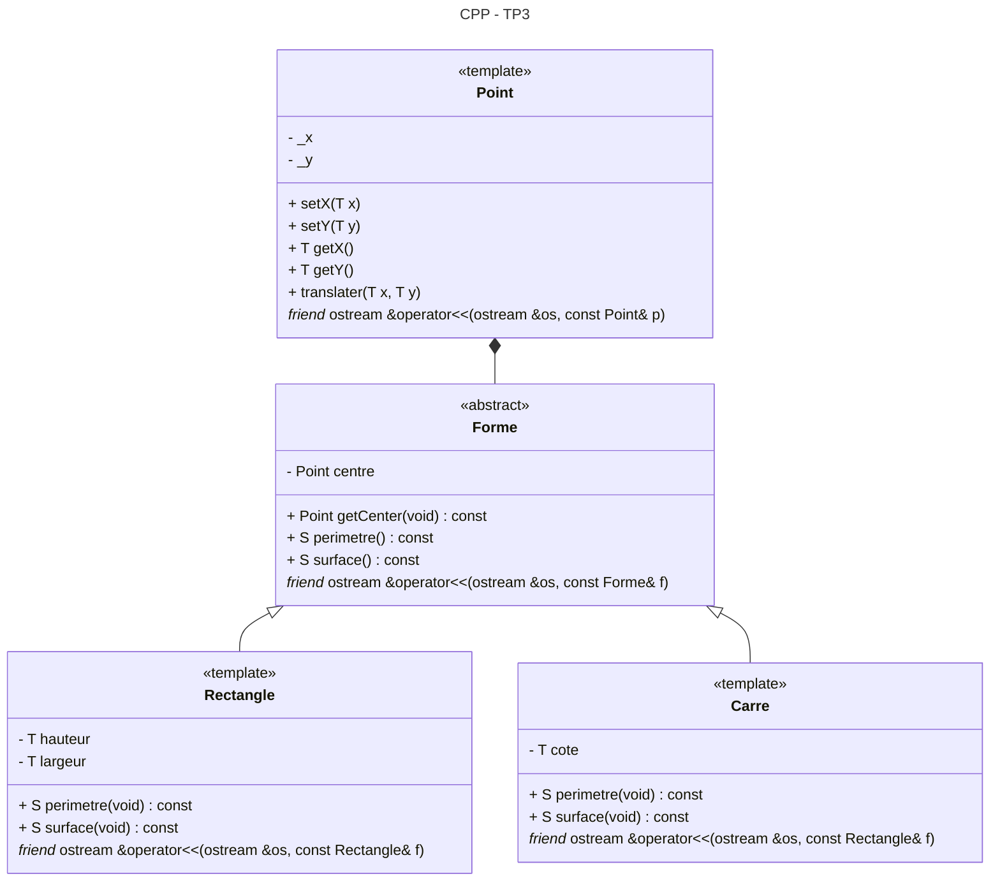

# Nathan - Eugénie

**/!\ ATTENTION**
> Nous avons développé chacun de notre coté, il y a donc 2 branches.  
> La branche main ne contient pas de code pour le moment.

## Build / Compilation

```sh
mkdir build
cmake -Bbuild .
```

```sh
cmake --build build/
```

```sh
./build/CPP_TP3_EUGE_NATH
```

## Diagramme de classe

